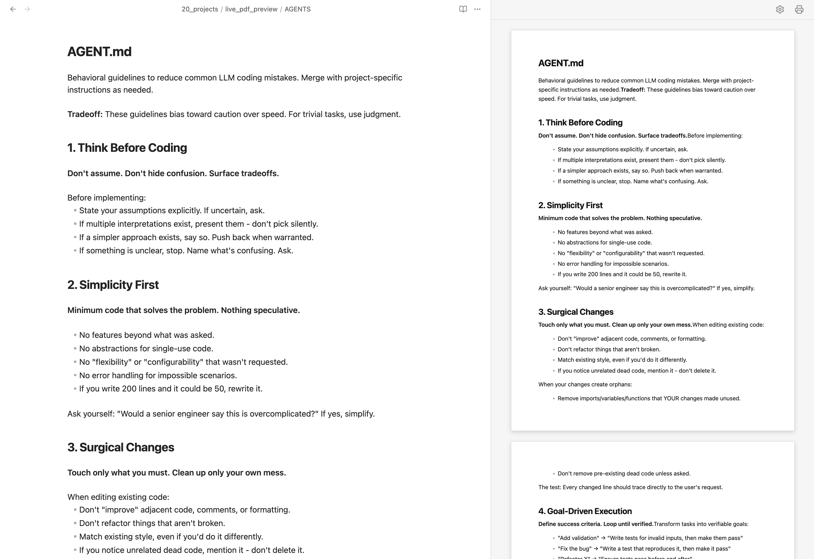
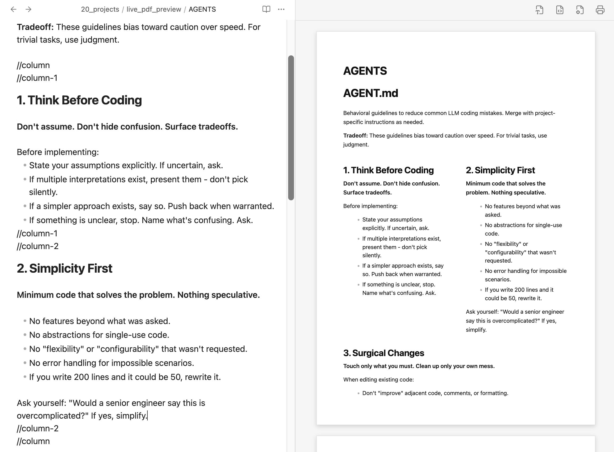
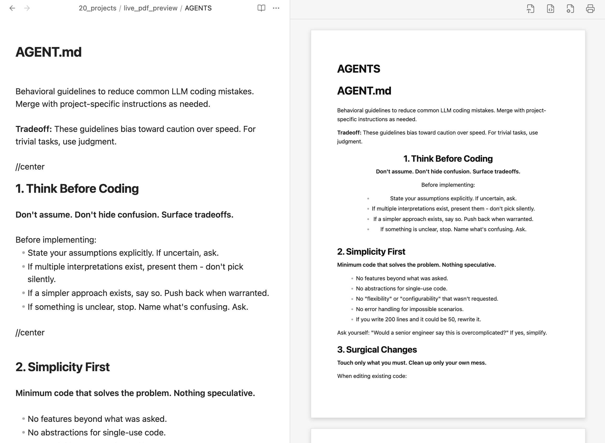
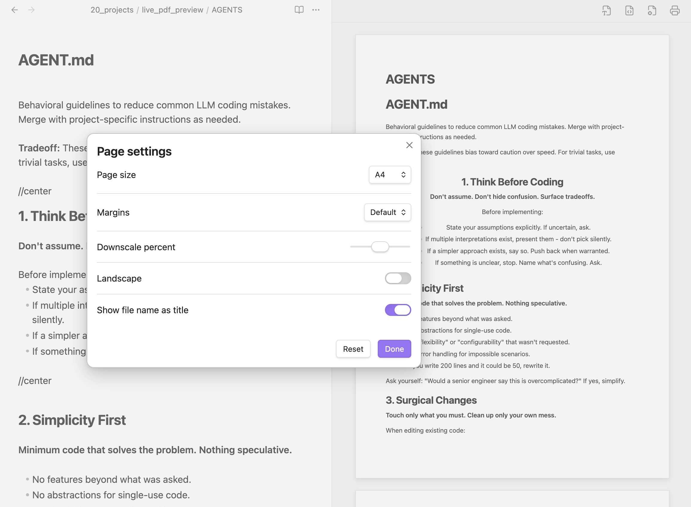
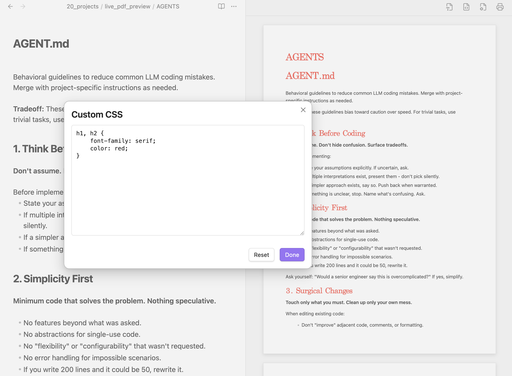

# Obsidian Live PDF Preview

Obsidian에서 문서를 편집하면서 **실제 인쇄물(A4) 형식의 레이아웃을 실시간으로 확인하고, 클릭 한 번으로 목차 이동이 가능한 고품질 PDF로 저장**할 수 있는 플러그인입니다.

문서 작성과 인쇄 편집(출판 레이아웃)을 동시에 처리해 주는 편리한 문서 도구입니다.

## 이런 분들께 추천합니다!

- Obsidian으로 리포트, 이력서, 기획서, 에세이 등 **출력용 문서**를 자주 작성하시는 분.
- PDF로 내보내기 전에 **줄바꿈이나 여백이 용지에 딱 맞는지 실시간으로 확인**하고 싶으신 분.
- 내보낸 PDF 파일에 마우스 클릭으로 즉시 이동할 수 있는 **바로가기 목차(책갈피)**를 자동으로 넣고 싶으신 분.

## 주요 기능 안내

### 1. 실시간 인쇄 미리보기

- **실시간 페이지 렌더링:** 작성 중인 문서를 실제 용지(A4, Letter, A3, A5 등) 크기에 맞춰 우측 사이드바에 즉각 확인 가능하게 렌더링합니다.
- **반응형 화면 배율:** 사이드바 패널의 너비를 조절하면 용지가 비율에 맞춰 자동으로 확대/축소됩니다.

### 2. 에디터 커서 동기화

- **화면 자동 추적:** 현재 편집 중인 커서의 위치를 감지하여 미리보기 화면도 해당 영역에 맞게 부드럽게 자동으로 동기화하여 스크롤됩니다.

### 3. 페이지네이션 및 단 분할 자동 정렬

- **깔끔한 페이지 나눔:** 본문 단락, 목록, 표, 소스 코드 블록이 용지 하단 경계를 넘어가면 다음 페이지로 줄 단위 또는 행 단위로 자연스럽게 쪼개져 연결됩니다.
- **연속된 리스트 서식:** 페이지 경계에 걸쳐 나뉜 목록(List)도 중복 번호나 기호 없이 이어지는 내용만 예쁘게 연결됩니다.

### 4. 인쇄 레이아웃 제어 명령 (`//` 명령어)

이 플러그인은 줄 첫머리에 `//` 명령어를 단독으로 입력해 출판용 레이아웃을 세부적으로 관리할 수 있습니다:

- **`//page` (페이지 나누기):** 다음 페이지로 넘어가 새로운 용지에서 글을 시작하도록 지시합니다. 다단 컬럼 안에서 사용 시 해당 컬럼만 다음 장으로 보냅니다.
  
  
  
- **`//column` (다단 레이아웃):** 콘텐츠를 가로로 배치합니다 (`//column-1` ~ `//column-3` 최대 3단 지원). 에디터에서 엔터를 치면 닫는 태그가 자동완성됩니다.
  
  
  
- **`//center` (가로 중앙 정렬):** 문단, 표, 리스트, 이미지, 코드 블록을 화면 중앙에 보기 좋게 정렬합니다. 리스트의 경우 글자 가독성은 좌측 정렬로 살려주며, 스마트 자동완성을 제공합니다.

  

### 5. PDF 고품질 파일 저장 및 책갈피 연동

- **원클릭 PDF 저장:** 프린터 아이콘(🖨️)만 누르면 즉시 고화질 PDF 파일로 저장됩니다.
- **대화형 북마크(목차 책갈피):** 문서 내 헤더(# H1 ~ ###### H6)가 PDF 책갈피(북마크 바로가기)로 자동 변환됩니다. 한글 및 다양한 다국어 유니코드 문자셋을 완벽 지원합니다.
- **인쇄 전용 최적화:** 코드 블록 우측의 복사 버튼 등 실인쇄에 필요 없는 편집용 버튼은 인쇄물과 미리보기에서 자동으로 깔끔하게 감춰집니다.

## 사용 방법

### 1. 미리보기 실행하기

1. Obsidian 단축키 `Cmd/Ctrl + P`를 눌러 명령 팔레트를 엽니다.
2. `Open Live PDF Preview` 명령을 찾아서 실행합니다.
3. 우측 탭에 인쇄 미리보기 화면이 열립니다.

### 2. 용지 및 레이아웃 설정하기

미리보기 창 우측 상단의 ⚙️ (기어 아이콘)을 클릭하면 용지 및 프리뷰 설정을 조절할 수 있습니다:

| 설정 항목                          | 설명                                           | 제공 옵션                                    |
| :----------------------------- | :------------------------------------------- | :--------------------------------------- |
| **Page size (용지 종류)**          | 출력용 가상 페이지의 물리적 크기를 결정합니다.                   | A4, Letter, A3, A5, Legal                |
| **Margins (여백 조절)**            | 용지의 바깥 테두리 여백 크기를 지정합니다.                     | Default (20mm), None (0mm), Small (10mm) |
| **Downscale percent (화면 스케일)** | 글꼴 크기 및 문서 전체 레이아웃의 배율을 조정합니다.               | 50% ~ 150% (기본값: 100%)                   |
| **Landscape (가로 출력)**          | 가로 방향(Landscape)과 세로 방향(Portrait) 출력을 전환합니다. | 활성/비활성 토글                                |
| **Show file name as title**    | 파일명을 문서 맨 위에 메인 대제목(H1)으로 렌더링합니다.            | 활성/비활성 토글                                |

### 3. 커스텀 CSS 스타일시트 (Custom CSS)

미리보기 헤더 우측의 팔레트(🎨) 아이콘을 클릭하여 사용자 정의 CSS를 적용할 수 있습니다

## 라이선스 (License)

이 프로젝트는 [MIT 라이선스](LICENSE)를 따릅니다.

## 기여하기 (Contributing)

이슈 제보 및 풀 리퀘스트(PR)를 통한 기여를 언제나 환영합니다!