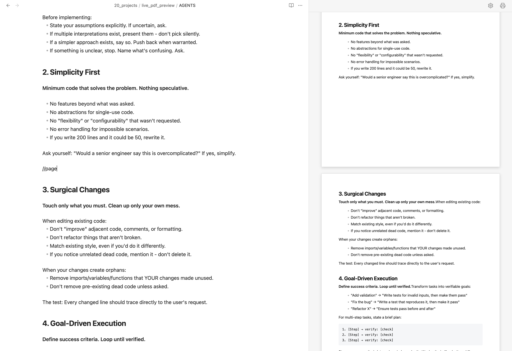
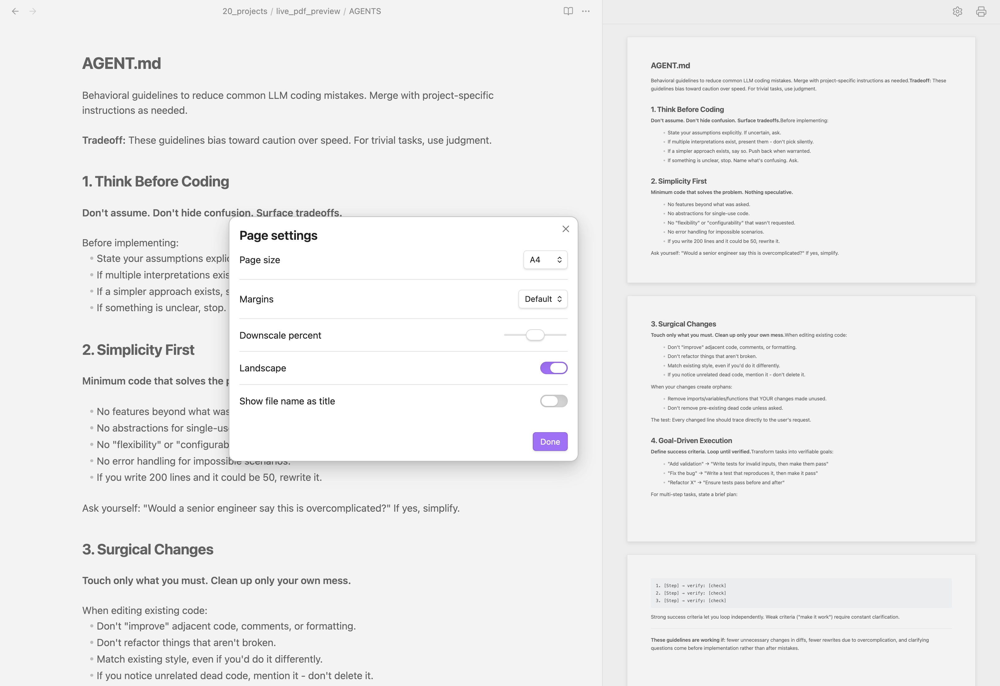

# Obsidian Live PDF Preview

An Obsidian plugin that lets you edit Markdown documents while **viewing a real-time, print-formatted A4 preview in the sidebar**, and **exports them into high-quality PDFs with interactive navigation bookmarks in one click**.

It streamlines your writing workflow by combining document editing and publication layout design into one seamless process.

## Who is this for?
* **Writers** composing print-ready documents like reports, resumes, proposals, and essays directly in Obsidian.
* **Publishers** who want to verify line wraps, margins, and page breaks in real-time before exporting.
* **Readers** who want exported PDFs to automatically feature click-navigable outlines/bookmarks for easy reading.

## Key Features

### 1. Zero-Flicker Real-Time Preview
* A virtual A4 sheet (`210mm` x `297mm`) appears in the right sidebar, rendering your edits instantly.
* **Twin-Canvas Page Flipping:** Powered by an atomic double-buffering architecture, the preview updates seamlessly as you type with absolutely **zero screen flashes or flickers**.
* The preview scales and fits automatically when you expand or shrink the sidebar panel width.

### 2. Smart Edit-Position Scroll Sync
* **Automatic Viewport Alignment:** The plugin detects your active cursor position. If you start editing a section that is out of the preview's viewport, it smoothly scrolls to align that block to the top of the preview screen.
* **Intelligent Visibility Guard:** If your editing position is already visible on the screen, the scroll remains locked to prevent dizzying screen jitters while typing.

### 3. Smart Page Transitions & Pagination
* Text blocks and list items that overflow the page boundary split cleanly **line-by-line onto the next page** instead of cutting off mid-character.
* Continued list items across page breaks automatically omit duplicate bullet points or numbering prefixes for a clean publication format.

### 4. Custom Page Breaks (`//page`)
* Want to start a new page? Simply type **`//page`** on its own line in the editor, and the subsequent content will begin on a fresh page instantly.

### 5. One-Click PDF Export with Outlines
* Click the 🖨️ (printer icon) on the top right of the preview header to save your document as a PDF.
* Document headings (`# H1` to `###### H6`) are automatically converted into **interactive PDF outlines (bookmarks)**, allowing readers to jump between sections in any PDF viewer.
* **Unicode Outline Support:** Fully supports non-ASCII / Unicode characters (like Korean, CJK, etc.) in the PDF Outline navigation tree without text corruption.
* **Clean Print Layout:** Obsidian's default code block copy buttons are automatically hidden inside both the A4 preview screen and the exported PDF to ensure visual publication quality.

## How to Use

### 1. Launching the Preview
1. Open the Obsidian Command Palette (`Cmd/Ctrl + P`).
2. Search for and select the `Open Live PDF Preview` command.
3. The print preview tab will open in the right sidebar.

### 2. Customizing the Page Layout
Click the gear icon (⚙️) on the top right of the preview header to open page settings:
* **Page size:** Select A4, Letter, A3, A5, or Legal dimensions.
* **Margins:** Choose Default (20mm), None (0mm), or Small (10mm).
* **Downscale percent:** Scale/Zoom the preview text and layout size (50% to 150%).
* **Landscape:** Toggle between Portrait and Landscape layouts.
* **Show file name as title:** Automatically render the filename as the main document header.

## Multilingual Readme
* [한국어 버전 (Korean Version)](./README.ko.md)